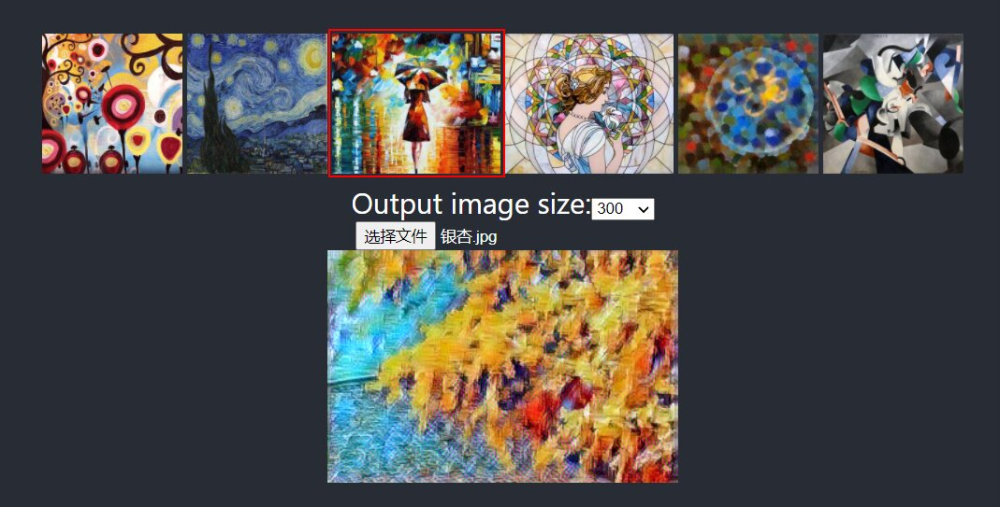

# Style transfer web app

> **Checkout the website live at** : https://vicalloy.github.io/image-transformer/

React App for style transfer using ONNX Runtime Web.



## Usage

```
git clone https://github.com/vicalloy/image-transformer.git
```
Get the code.

```
yarn install
```
Install all dependencies from the project root folder.

```
yarn prepare
```
Copy *.wasm file to `public` directory and download onnx models from GitHub.

```
yarn start
```
Runs the app in the development mode.<br />
Open [http://localhost:3000/image-transformer](http://localhost:3000/image-transformer) to view it in the browser.

The page will reload if you make edits.<br />
You will also see any lint errors in the console.

## Thanks to

Some codes and models come from 

- https://github.com/kleinicke/fast_web_style_transfer/
- https://github.com/microsoft/onnxruntime-web-demo
- https://github.com/onnx/models/tree/master/vision/style_transfer/fast_neural_style
